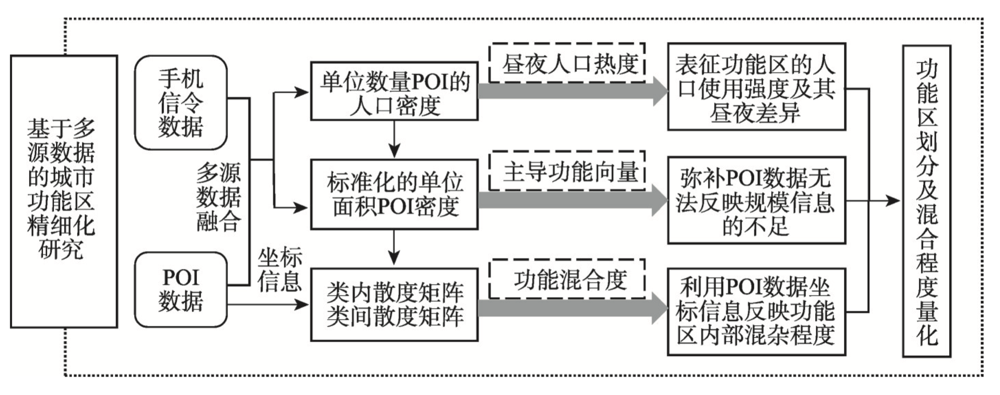
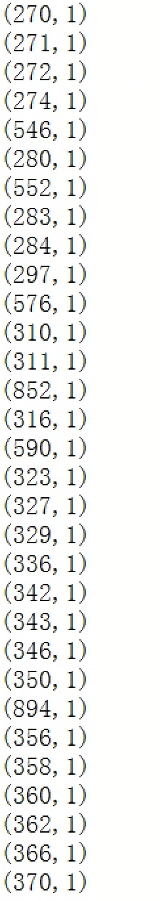
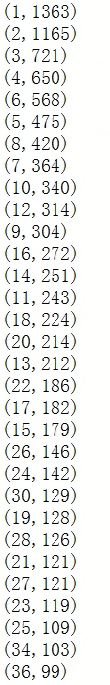

# 过程记录

## 4 月 28 日 方法分析

### 城市区块划分

#### 城市功能区类别分类表

| 功能区分类     | 编号 | POI 原始分类 | 城市用地小类      | 日夜活跃情况 | 城市用地大类               |
| -------------- | ---- | ------------ | ----------------- | ------------ | -------------------------- |
| 交通设施及服务 | 0    | 通行设施     | 道路用地          | 日、夜       | 道路与交通设施用地         |
|                |      | 汽车服务     | 服务业用地        |              |                            |
|                |      | 停车场       | 停车厂库用地      |              |                            |
|                |      | 公共交通站点 | 交通广场用地      |              |                            |
|                |      | 交通执法设施 | 其他交通设施用地  |              |                            |
|                |      | 交通设施     | 交通设施用地      |              |                            |
| 居住及相关服务 | 1    | 住宿服务     | 旅馆业用地        | 夜           | 居住用地                   |
|                |      | 住宅         | 居住用地          |              |                            |
|                |      | 地名地址信息 | 街道区划信息      |              |                            |
| 文体与科教服务 | 2    | 体育休闲服务 | 体育用地          | 日、夜       | 公共管理与公共服务设施用地 |
|                |      | 教育设施     | 教育科研用地      |              |                            |
|                |      | 文化传媒     | 文化用地          |              |                            |
| 政府及公共设施 | 3    | 公共设施     | 公共设施用地      | 日           | 公共管理与公共服务设施用地 |
|                |      | 政府办公     | 行政办公用地      |              |                            |
| 企业           | 4    | 公司企业     | 商务办公\工业用地 | 日、夜       | 工业用地                   |
| 医疗           | 5    | 医疗保健     | 医疗卫生用地      | 日           | 公共管理与公共服务设施用地 |
| 生活服务       | 6    | 购物服务     | 商业用地          | 日、夜       | 商业服务业设施用地         |
|                |      | 物流服务     | 物流服务          |              |                            |
|                |      | 生活服务     | 服务业用地        |              |                            |
| 餐饮服务       | 7    | 餐饮服务     | 服务业用地        | 日、夜       | 商业服务业设施用地         |
|                |      | 酒店服务     | 服务业用地        |              |                            |
| 旅游           | 8    | 风景名胜     | 绿地、公园        | 日           | 绿地与广场用地             |
| 金融服务       | 9    | 金融保险     | 金融保险业用地    | 日           | 商业服务业设施用地         |

#### 研究框架

## 4 月 27 日 描述性统计

至少被访问过一次的有效停留点：1.1 万左右

下图中，对于 (x, y)，表示一周内被访问 x 次的基站有 y 个。

